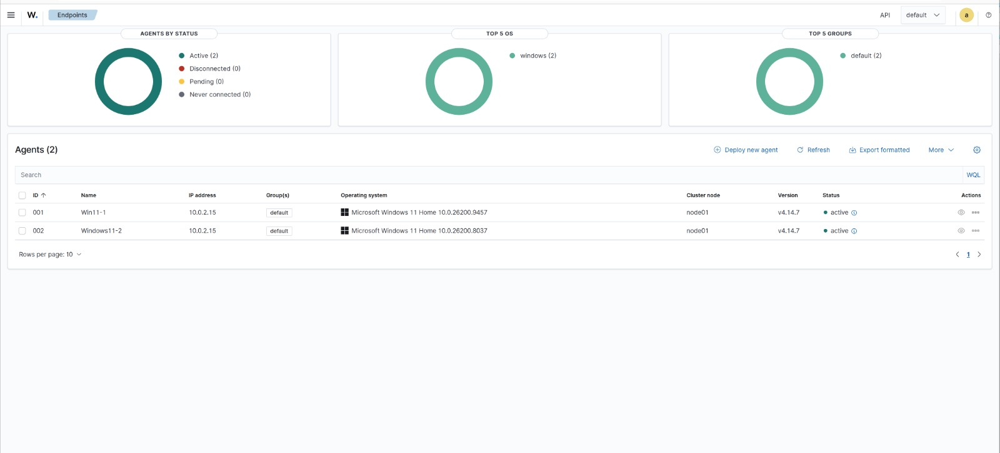
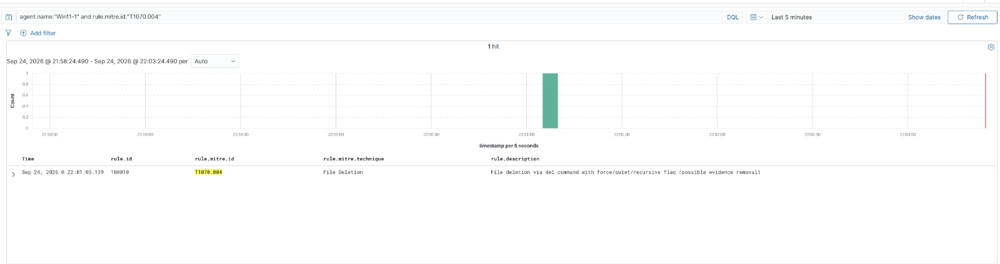
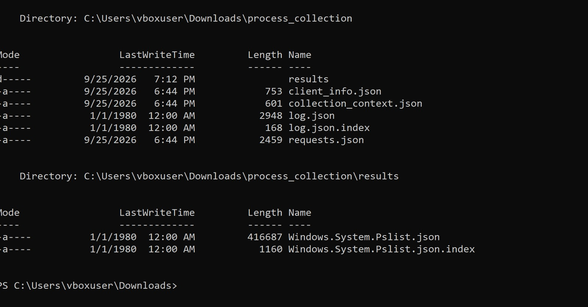
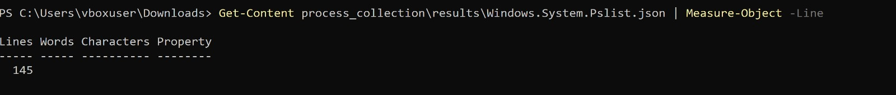

# Enterprise Endpoint Detection Lab (Wazuh EDR/XDR)

A hands-on lab replicating EDR analyst/engineer work: deploying an open-source
EDR/XDR platform across a small fleet, validating existing detection coverage against
real attack simulations, finding gaps, and writing a custom detection rule to close one.


## Architecture

```
                    ┌─────────────────────────────┐
                    │   Wazuh Server (Ubuntu VM)   │
                    │  - Wazuh Manager             │
                    │  - Wazuh Indexer             │
                    │  - Wazuh Dashboard           │
                    └──────────────┬────────────────┘
                                   │  TLS (1514/1515)
              ┌────────────────────┴────────────────┐
              │                                      │
    ┌─────────▼─────────┐                  ┌─────────▼─────────┐
    │  Windows Endpoint  │                  │  Windows Endpoint  │
    │  (Win11-1)          │                  │  (Windows11-2)      │
    │  Wazuh Agent        │                  │  Wazuh Agent        │
    │  + Sysmon           │                  │  + Sysmon           │
    └─────────────────────┘                  └─────────────────────┘
```



## What this lab covers

- [x] Deploy Wazuh manager, indexer, and dashboard
- [x] Deploy 2 Wazuh agents (Windows) and confirm active status
- [x] Install Sysmon (SwiftOnSecurity baseline) on Windows endpoints
- [x] Point Wazuh at the Sysmon log channel
- [x] Run Atomic Red Team simulations against mapped ATT&CK techniques
- [x] Identify a real detection gap (T1070.004 file deletion mismapped to T1059.003)
- [x] Author a custom Wazuh detection rule, informed by a SigmaHQ reference rule
- [x] Validate the custom rule by re-running the corresponding Atomic test
- [x] Test the rule against benign activity to check for false positives
- [x] Document agent-health monitoring process
- [x] Use Velociraptor for a standalone DFIR collection task

## Tech stack

| Component | Purpose |
|---|---|
| [Wazuh](https://wazuh.com) | Open-source EDR/XDR — manager, indexer, dashboard, agents |
| [Sysmon](https://github.com/SwiftOnSecurity/sysmon-config) | Deep Windows telemetry (process, network, registry) |
| [Atomic Red Team](https://github.com/redcanaryco/atomic-red-team) | Attack simulation mapped to MITRE ATT&CK |
| [MITRE ATT&CK](https://attack.mitre.org) | Technique framework used to map detections |
| [Sigma](https://github.com/SigmaHQ/sigma) | Reference detection logic, adapted into a Wazuh rule |
| [Velociraptor](https://docs.velociraptor.app) | Endpoint DFIR / forensic collection (standalone mode) |

## Repo structure

```
endpoint-detection-lab/
├── README.md                    # You are here
├── docs/
│   └── deployment.md            # Full deployment log
├── detection-rules/
│   ├── local_rules.xml          # Custom Wazuh detection rule
│   └── rule-notes.md            # What the rule does, why it was needed, and its limits
├── atomic-tests/
│   └── test-log.md              # Every Atomic Red Team test run and its result
└── screenshots/
    └── ...                      # Evidence for each step below
```

## Key finding

Testing MITRE ATT&CK techniques against Wazuh's default ruleset showed a mix of
outcomes: one detection, one technique detected but mapped to the wrong
technique ID, and one gap (a file-deletion command thatwent unlabelled). That gap became the basis for
custom rules — see [detection-rules/rule-notes.md](detection-rules/rule-notes.md)

**Before** — the file-deletion command mismapped to T1059.003 instead of T1070.004:


**After** — the custom rule correctly tagging the same behavior as T1070.004:



## Velociraptor demo

Used Velociraptor's standalone collector mode (no server setup required) to run a real
forensic artifact collection — capturing a detailed process snapshot with file hashes
and Authenticode signature data, well beyond what Task Manager or `systeminfo` expose.




## Environment

- **Wazuh server:** Ubuntu VM — Wazuh 4.14.x (manager + indexer + dashboard, single-node)
- **Endpoints:** 2 Windows VMs running the Wazuh agent + Sysmon
- All agent↔manager traffic is TLS-encrypted; certs generated via the Wazuh certificate
  generation tool (see [docs/deployment.md](docs/deployment.md)).
