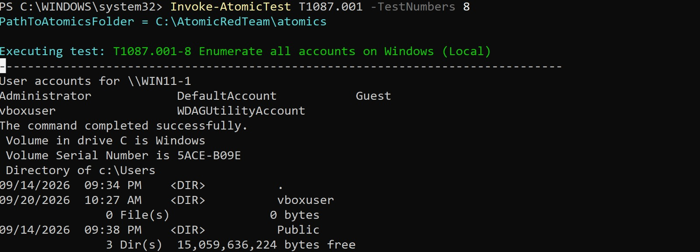
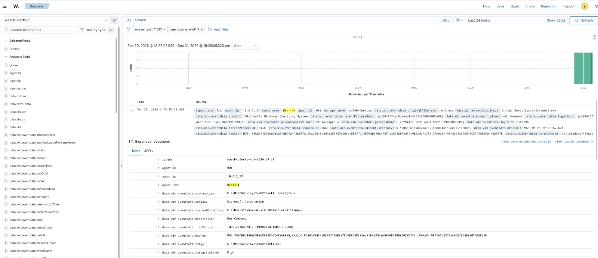
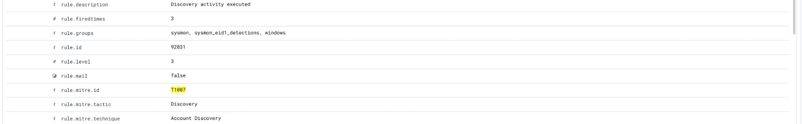
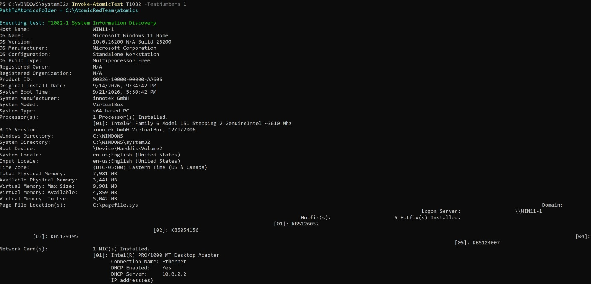
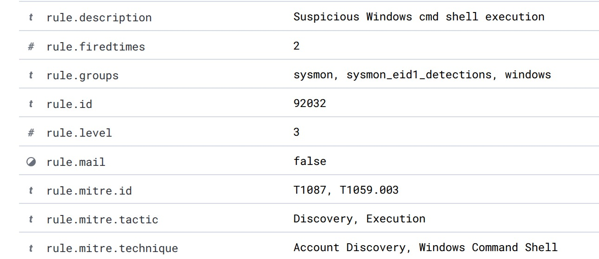
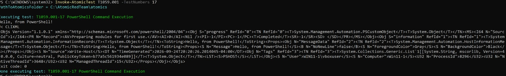
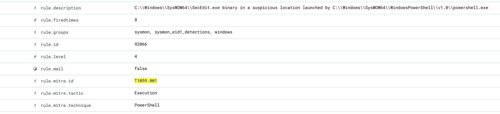
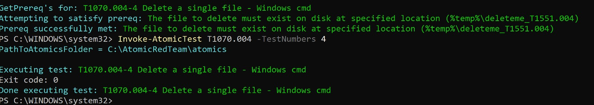
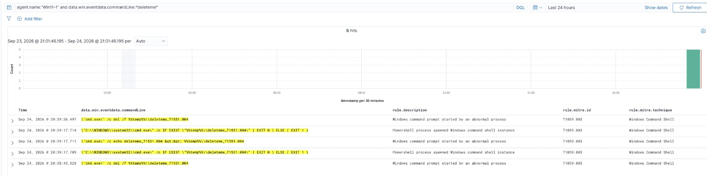

# Atomic Red Team Test Log

Every technique tested, the exact command run, and what Wazuh actually did with it.
"Detected" means a Wazuh alert fired. "Mapped correctly" means the alert's
`rule.mitre.id` matched the technique actually being tested.

## Test 1 — T1087.001 (Account Discovery: Local Account)

- **Tactic:** Discovery
- **Command:** `net localgroup` (via Atomic test T1087.001-8)
- **Endpoint:** Win11-1
- **Result:** Detected and correctly mapped
- **Rule fired:** `92031` — "Discovery activity executed"
- **MITRE mapping shown:** T1087 (Wazuh's built-in rule tags the parent technique,
  not the `.001` sub-technique — a normal limitation of the default ruleset, not an error)

## Test 2 — T1082 (System Information Discovery)

- **Tactic:** Discovery
- **Command:** `systeminfo` (chained with a registry query, via Atomic test T1082-1)
- **Endpoint:** Win11-1
- **Result:** Detected, but mismapped
- **Rule fired:** `92032` — "Suspicious Windows cmd shell execution"
- **MITRE mapping shown:** T1087 (Account Discovery) and T1059.003 (Windows Command
  Shell) — **not** T1082, the technique actually being tested. Wazuh matched the
  general pattern of a cmd shell chaining commands together, not the specific intent.

## Test 3 — T1059.001 (Command and Scripting Interpreter: PowerShell)

- **Tactic:** Execution
- **Command:** Simple PowerShell command execution (Atomic test T1059.001-17)
- **Endpoint:** Win11-1
- **Result:** Detected and correctly mapped
- **MITRE mapping shown:** T1059.001

## Test 4 — T1070.004 (Indicator Removal: File Deletion)

- **Tactic:** Defense Evasion
- **Command:** `cmd.exe /c del /f %temp%\deleteme_T1551.004` (Atomic test T1070.004-4)
- **Endpoint:** Win11-1
- **Result:** ❌ Real detection gap
- **Rule fired:** `92052` — "Windows command prompt started by an abnormal process"
- **MITRE mapping shown:** T1059.003 (Windows Command Shell) — no rule recognized the
  actual file-deletion behavior. Confirmed consistent across 5 related events in the
  same test run, not a one-off fluke.

- **Outcome:** This gap became the basis for a custom rule — see detection-rules/rule-notes.md

