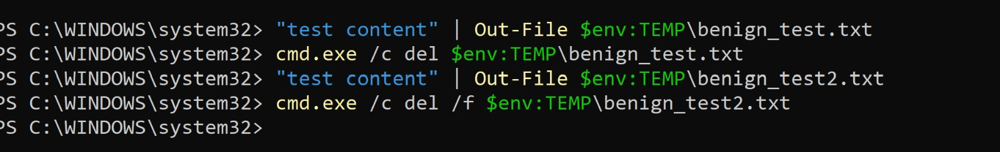
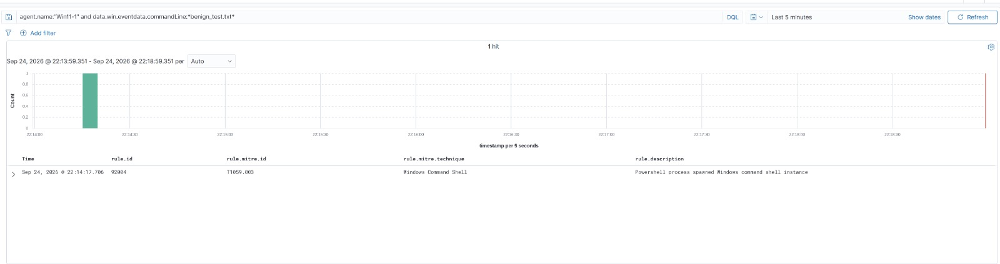
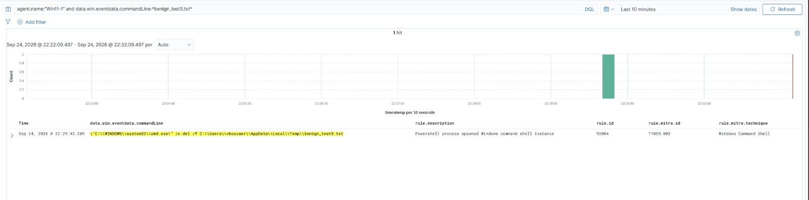

# Custom Detection Rule Notes

## Rule 100010 — File Deletion via `del` command

**Why this rule exists:** Testing T1070.004 (File Deletion) with Atomic Red Team showed
that Wazuh's default ruleset detects *that* a command shell ran, but has no rule
recognizing a `del` command with a force/quiet/recursive flag as file-deletion behavior specifically. View `atomic-tests/test-log.md`, Test 4, for more details.

**Reference used:** [SigmaHQ — File Deletion Via Del](https://github.com/SigmaHQ/sigma/blob/master/rules/windows/process_creation/proc_creation_win_cmd_del_execution.yml).
Sigma's logic: flag `cmd.exe` running a `del`/`erase` command that also includes a
force, quiet, or subdirectory flag (`/f`, `/s`, `/q`). This narrows it down from a casual,
single-file delete to a more deliberate one.

**Wazuh rule (final version):**
```xml
<rule id="100010" level="6">
  <decoded_as>windows_eventchannel</decoded_as>
  <field name="win.system.eventID">^1$</field>
  <field name="win.eventdata.commandLine" type="pcre2">(?i)cmd\.exe.*\bdel\b.*(-f|/f|-s|/s|-q|/q)</field>
  <description>File deletion via del command with force/quiet/recursive flag (possible evidence removal)</description>
  <mitre>
    <id>T1070.004</id>
  </mitre>
</rule>
```

**Validation:** Re-ran the same Atomic test (T1070.004-4) after loading the rule.
Wazuh correctly produced an alert with `rule.id: 100010` and `rule.mitre.id: T1070.004`
— the correct mapping, replacing the earlier `T1059.003` mismap.


## False-positive testing 

To check the rule wasn't broad, I ran two tests:

1. A plain `del` with no flag — correctly did **not** trigger rule 100010.This was the expected
   result (true negative).
2. A `del /f` on a test file — this **should** have triggered rule
   100010 but it didn't.






**Root cause:** The rule's first version used `<if_sid>92052</if_sid>`, meaning it only
evaluated after Wazuh's generic rule `92052` fired first. On the test, a
identical command got classified under a *different* generic rule
(`92004`) instead of `92052` — so my rule, waiting specifically for `92052`, never got
evaluated at all, even though the actual malicious-looking pattern was present.

**Fix:** Replaced the `<if_sid>92052</if_sid>` dependency with a direct check against
the decoded event itself:
```xml
<decoded_as>windows_eventchannel</decoded_as>
<field name="win.system.eventID">^1$</field>
```
This makes the rule evaluate independently of which other generic rule fires alongside
it.

**Status:** The corrected version was loaded and is believed to resolve the issue based
on the logic but would need to be further tested.

## Known limitations

- The rule matches on command-line **pattern**, not actual intent — a legitimate
  sysadmin force-deleting a locked file would also trigger it. In a real environment,
  this rule would benefit from additional context (e.g. only alerting when paired with
  an unusual parent process) to reduce false positives further.
- Wazuh's default ruleset tags sub-techniques inconsistently (parent-only IDs in some
  cases, like T1087 instead of T1087.001) — good to to remember when relying on
  `rule.mitre.id` for precise sub-technique reporting.
